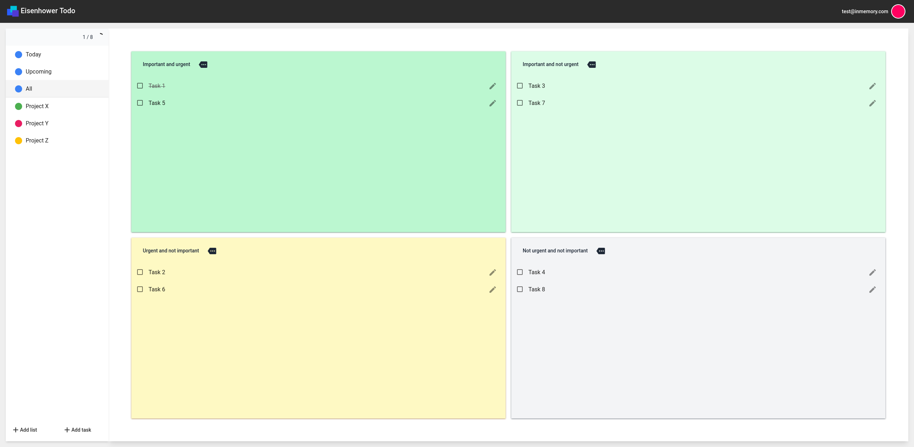

# Fullstack example

A small todo app. 

## Frontend 
The client ist written in Angular.

### Demo

All images of the frontend client can be found in [pictures](./pictures/).

## Backend
The whole backend is written in .NET 6 with EF Core as the data persistence layer, Postgres as the Database and ASP.NET Core as the API layer.

## DevOps

Work in progress: probably Ansible & Terraform. Some kind of Loadbalancer and some connection pooler for the db. 

